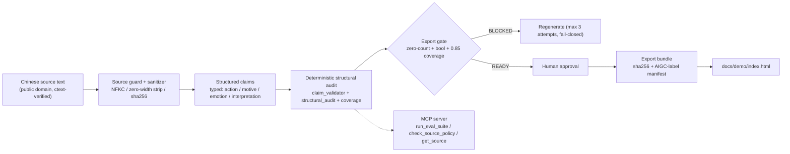

# Guwen Reactor

A source-grounded adaptation engine for public-domain Classical Chinese (古文
*gǔwén*) stories, built behind a deterministic **faithfulness gate** that
blocks export on any unsupported claim.

> **Kaggle "AI Agents: Intensive — Vibe Coding" capstone.** Track: Agents for
> Good. Deadline: 2026-07-06.

## Problem

English-speaking educators want to bring Classical Chinese stories into the
classroom, but they cannot read the source themselves and are accountable
for accuracy in front of students. An AI-generated adaptation is only usable
if a teacher can trust — and verify — that it did not invent anything the
source doesn't say.

## What it does

Guwen Reactor takes an original, public-domain Chinese source text and
generates an English adaptation whose claims are individually checked
against a hand-built gold fact list, through a **deterministic** audit (no
LLM self-report, no "trust me"). Export is blocked unless every check
passes and a human approves.

The wow: you don't have to take the gate's word for it. The demo lets you
**turn the gate off** and watch a fabricated line get caught, live, in your
own browser.

## Demo

Open [`docs/demo/index.html`](docs/demo/index.html) directly in any
browser. No server, no network call, no API key, no build step.

What to try:
1. Click an article station on the map — three (管寧割席, 詠雪, 道旁苦李)
   have lit lamps, meaning they've cleared the full pipeline; the other
   seven are collected and source-verified but honestly shown dark, not
   disguised as checked.
2. Click any highlighted line in a lit article to open its **考據**
   (provenance) card: the original Chinese it's grounded in, side by side
   with the engine's verdict.
3. Open the **如果没有闸门** ("what if the gate were off") tab. It runs a
   small subset of the real engine — the same committed facts and
   forbidden-claim list — live in your browser against a prepared
   fabrication, and shows it get flagged and export-blocked. "Try another
   fabrication" rotates through different failure modes (contradiction,
   unhedged-motive claim), so it isn't just keyword matching.

## Architecture



The gate definition lives in exactly one place, `specs/eval_plan.yaml`, and
`app/policy_gate.py` loads it — no second copy of the rules to drift out of
sync. `app/mcp_server.py` wraps the same pipeline as three stdio MCP tools
so an agent can request an audit or check source policy without ever
touching raw source text (it only ever gets metadata pointers back).

## Setup

```bash
python3 -m venv .venv
source .venv/bin/activate
pip install -r requirements.txt
pytest evals/               # 136 passed
python -m app.mcp_server    # runs the MCP stdio server
```

Developed and tested on Python 3.14 (pinned deps in `requirements.txt`);
other recent versions are untested.

## Course-concept mapping

| Concept | Rubric category | Evidence |
|---|---|---|
| MCP Server | Code | `app/mcp_server.py` — 3 stdio tools wrapping the deterministic gate, pinned `mcp==1.28.1` |
| Security features | Code | public-domain-only source guard, sanitizer (NFKC/zero-width/sha256), prompt-injection detection, metadata-only source access, fail-closed regeneration cap |
| Deployability | Video | `docs/demo/index.html` — single file, zero external requests, no API key, opens in any browser |

The submission demonstrates the three course concepts above. (Antigravity was used to publish the public repository; it is not claimed as one of the demonstrated concepts, since the submission video does not show it.)

## Repo map

- `app/` — CLI, MCP server, policy gate, approval/export
- `guwen_core/` — source sanitizer, claim validator, structural audit, coverage, adaptation generator
- `evals/` — pytest suite (136 tests) + the `evaluate_run` orchestrator
- `specs/` — `eval_plan.yaml` (canonical gate contract), product spec, threat model
- `data/` — gold fact lists (`canon_gold.yaml`) and source texts (`data/sources/`)
- `docs/demo/` — the offline demo and its own README
- `docs/` — build log, handovers, planning archive, capstone writeup
- `designs/` — demo prototype iterations
- `reviews/` — adversarial reviews and the tier-2 source-text verification record
- `runs/` — fixture run directories used by the eval suite and demo
- `tools/` — map/font build scripts for the demo

## Limitations

- Gold facts are single-annotator; independent second-reader
  cross-validation is documented as a planned but not-yet-run check
  (`data/gold/independent_check_notes.md`).
- Only 3 of 10 collected articles have been through the full pipeline
  (structured claims, engine audit, independent review) — the demo shows
  this honestly rather than hiding it. The other 7 are source-verified
  against the ctext 《四部叢刊初編》 edition but not yet claim-audited.
- The in-browser "flip the gate" demo is a simplified rule subset for live
  interactivity, not the full engine. The full deterministic engine (131
  engine tests; 136 in the full suite including 5 MCP-server wrapper tests)
  runs in the build pipeline and is what every published verdict is based on.
- Two upstream stage gates in `evals/run_eval_suite.py` (`source_policy_valid`,
  `workflow_integrity_pass`) are default-pass stubs with TODOs — their real
  checks are not wired yet. The content gates that block export
  (unsupported-claims == 0, beat coverage ≥ 0.85, structural safety deny-list)
  are real and tested.
